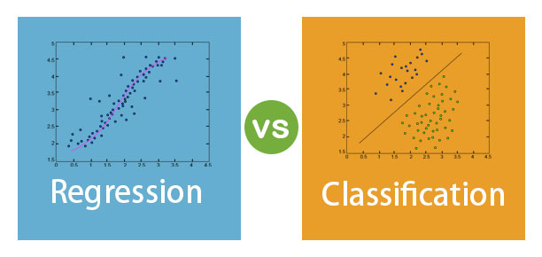
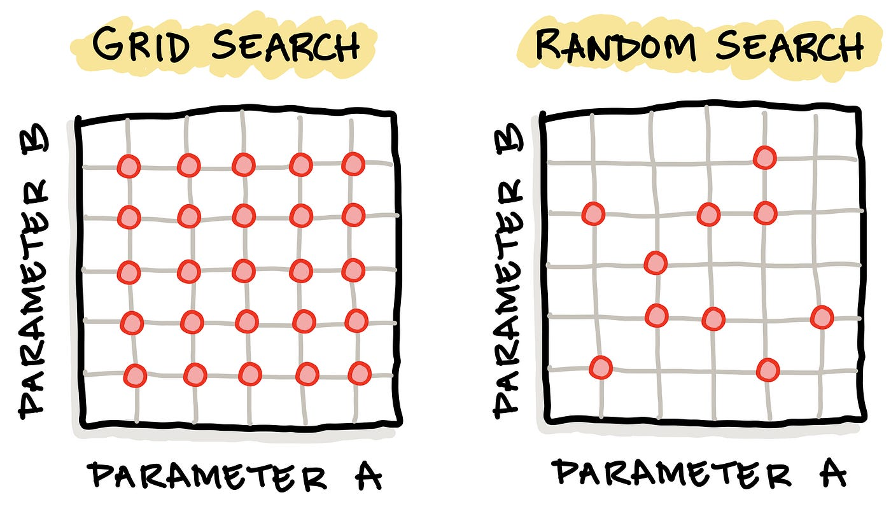

#  Machine Learning Model Comparison & Hyperparameter Tuning

This repository showcases a hands-on machine learning project focused on:

✅ Comparing multiple ML models  
✅ Evaluating them using real-world metrics  
✅ Optimizing their performance using hyperparameter tuning

As a Machine Learning enthusiast, this project is part of my ongoing learning journey to better understand how different algorithms perform on **classification** and **regression** tasks.

  

---

##  What’s Inside

This project is split into **two core notebooks**:

### 1. `classification-models.ipynb`  
**Goal**: Predict tumor type (benign/malignant) using the **Breast Cancer** dataset  
**Models Used**:
- Logistic Regression
- Decision Tree Classifier
- Random Forest Classifier  
**Metrics**:
- Accuracy, Precision, Recall, F1-Score  
**Tuning**:
- `GridSearchCV` & `RandomizedSearchCV` used for parameter optimization

---

### 2. `regression-models.ipynb`  
**Goal**: Predict house prices using the **California Housing** dataset  
**Models Used**:
- Linear Regression
- Decision Tree Regressor
- Random Forest Regressor  
**Metrics**:
- MAE (Mean Absolute Error)
- MSE (Mean Squared Error)
- RMSE (Root Mean Squared Error)
- R² Score  
**Tuning**:
- Applied both grid and randomized search to boost model performance

---

##  Key Concepts and Learnings

###  Why Hyperparameter Tuning?

Most machine learning models come with **hyperparameters** — settings like tree depth, number of estimators, or regularization strength — that control the model’s behavior.  
Choosing the **right values** for these can **dramatically improve accuracy** and generalization.

  

---

### 🔧 GridSearchCV

`GridSearchCV` is an **exhaustive search method** that tries out **every combination** of parameters you specify.  
It works like this:
- You define a grid of parameter values.
- It trains a model for each combination using **cross-validation**.
- Then it picks the one with the **best score** (e.g., highest accuracy or R²).

**Best for**: When the parameter grid is small or you want a **precise search**.

🟢 **Pros**:
- Guaranteed to find the best value in the grid  
- Easy to interpret

🔴 **Cons**:
- Can be very slow for large grids  
- Computationally expensive

---

###  RandomizedSearchCV

`RandomizedSearchCV` is a **smarter alternative** to Grid Search when the parameter grid is large.  
Instead of trying every combination, it:
- Randomly samples from the parameter space
- Trains a fixed number of models (`n_iter`)
- Still uses cross-validation for evaluation

**Best for**: Larger grids where GridSearch would take too long

🟢 **Pros**:
- Much faster than GridSearch  
- Often finds near-optimal results  
- Better when tuning **many parameters**

🔴 **Cons**:
- May not try the *absolute best* combo (but usually close)

  

---

##  Technologies Used

- Python  
- scikit-learn  
- pandas  
- numpy  
- matplotlib (for optional plotting)  
- Jupyter Notebook

---

##  Final Results

| Task           | Best Model               | Key Metric        |
|----------------|--------------------------|-------------------|
| Classification | Tuned Random Forest      | F1 Score ≈ 96.24% |
| Regression     | Tuned Random Forest      | R² Score ≈ 81.41% |

---

##  What I Learned

- How to apply different ML models to classification and regression problems  
- Importance of model evaluation using task-specific metrics  
- That **tuning hyperparameters is often as important as the model choice**  
- Practical use of `GridSearchCV` and `RandomizedSearchCV` to squeeze the best out of models
